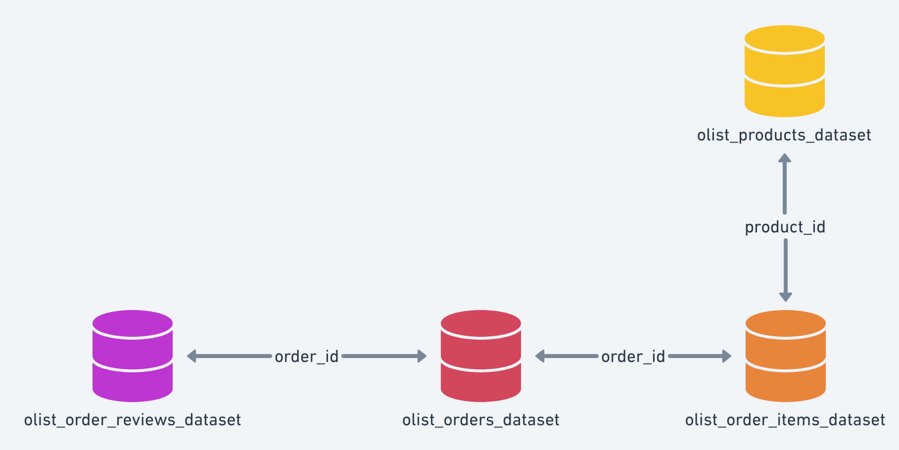

# ALAN_FURQUIM_DDF_TECH_022025
Case técnico base da empresa Dadosfera

Documento criado para responder os itens propostos no arquivo enviado.

## Item 0 - Sobre Agilidade e Planejamento
Foi criado um kanban board utilizando [um quadro no Trello](https://trello.com/b/5Ulenlp0/case-tecnico) para melhor organização dos status das diferentes tarefas.

## Item 1 - Sobre a Base de Dados
Para selecionar a base de dados, além de verificar sua adequação à proposta, também garanti que fosse suficientemente completa para viabilizar o desenvolvimento das etapas seguintes.
A base de dados escolhida foi a [Brazilian E-Commerce Public Dataset](https://www.kaggle.com/datasets/jayeshsalunke101/brazilian-ecommerce-public-dataset?select=olist_order_items_dataset.csv), do kaggle. 
Nesse dataset temos diversas tabelas diferentes, como apresentado na imagem a seguir. Cada uma delas tem diferentes informações sobre produtos, venda, vendedor, pagamento e reviews.

  
Para o desenvolvimento do case, foram selecionadas apenas 4 das 8 bases disponíveis, pois já continham dados suficientes para a execução dos itens necessários. As bases escolhidas abrangem informações sobre produtos, pedidos e reviews, conforme ilustrado na imagem abaixo.

  
Para unificar todos os dados em uma única tabela, foi utilizado um [notebook](/notebooks/concat_bases.ipynb), que carrega os diferentes dataframes e realiza a junção entre eles utilizando a biblioteca Pandas.
  

## Item 2.1 - Sobre a Dadosfera - Integrar
Com os dados devidamente selecionados, o arquivo foi enviado para a plataforma Dadosfera. O dataset está disponível no seguinte [link](https://app.dadosfera.ai/pt-BR/catalog/data-assets/aeeaf646-2a8a-4a97-903f-138582a1c5ac).
  

## Item  3 - Sobre a Dadosfera - Explorar
